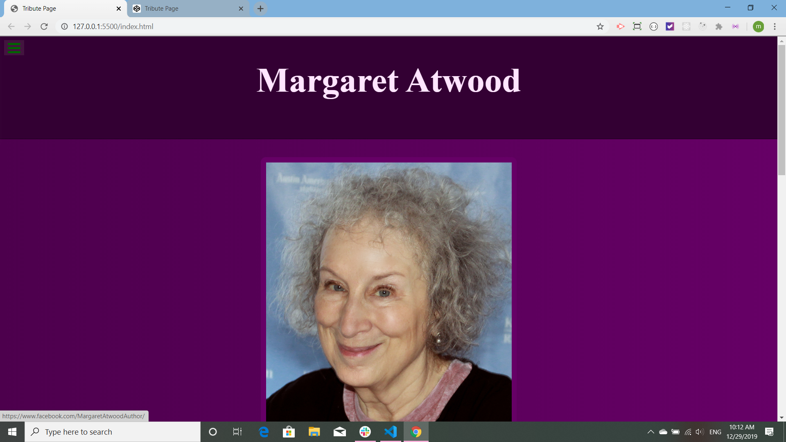
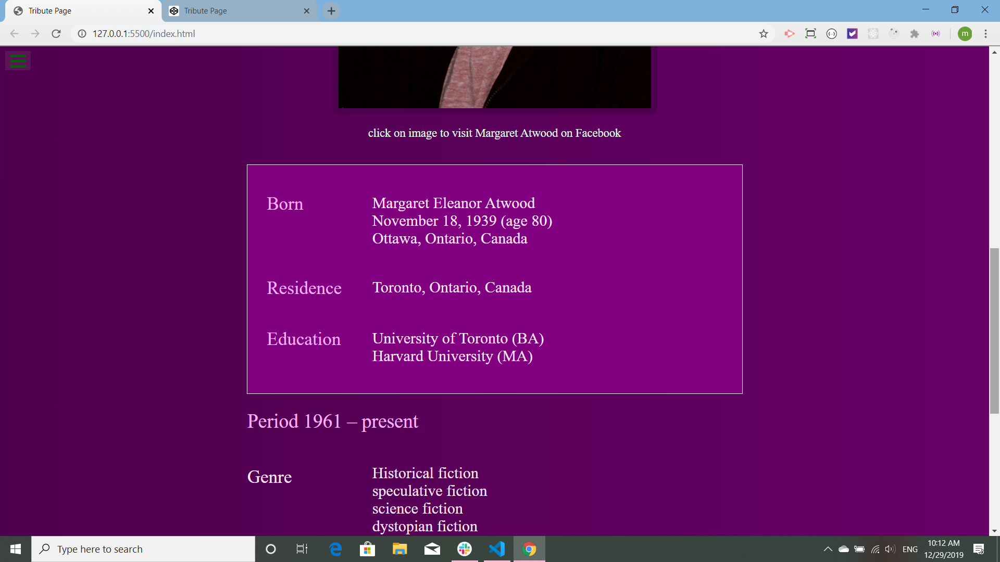
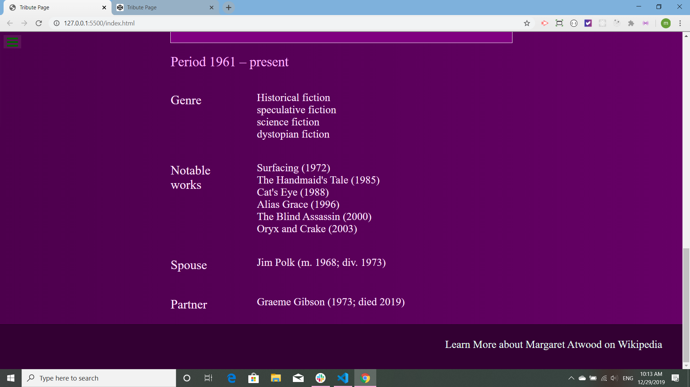
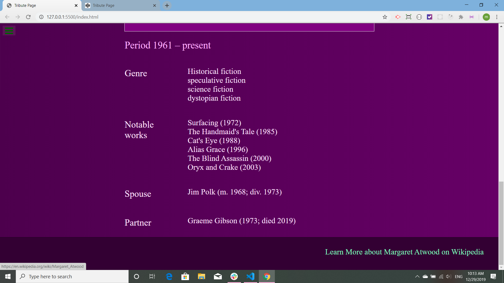

# FCC-tribute-page

This tribute page is an exercise for [The Free Code Camp](https://www.freecodecamp.org/). The Code is all mine. The image and all the information is from [Wikipedia](https://en.wikipedia.org/wiki/Margaret_Atwood). Thank-you Wikipedia for the free image! It is really not very flattering though, maybe that is why it was free, Wikipedia? That thing that pops open with the page sometimes is the testing software from The Free Code Camp.

This is the top of the page and the aforementioned image:

This is the middle of the page and the box I made to highlight the shamelessly lifted Wikipedia facts. It also shows that the questionable image is a link to Facebook. 

This is the bottom of the page and in the footer is a link to where I stole all the Wikipedia information:

A nice calm yellow would have been more appropriate, but I love my acid green active link. Please indulge.

This tribute page was originally published on [Code Pen](https://codepen.io/martucazpo/pen/zYxzEae) and is now also on [Git Hub]()